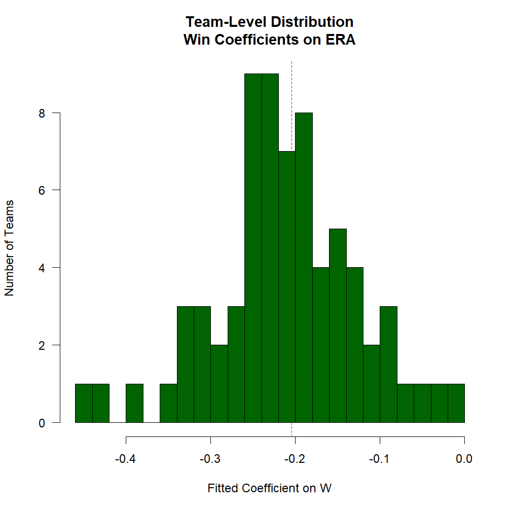

Esta viñeta explica las formas más comunes de usar la variable `.SD` en los análisis de `data.table`. Es una adaptación de [esta respuesta](https://stackoverflow.com/a/47406952/3576984) proporcionada en StackOverflow.

# ¿Qué es «.SD»?

En el sentido más amplio, `.SD` es simplemente una abreviatura para capturar una variable que aparece con frecuencia en el contexto del análisis de datos. Puede entenderse como *S*ubset, *S*elfsame, o *S*elf-reference of the *D*ata. Es decir, `.SD` es en su forma más básica una _referencia reflexiva_ a la `data.table` en sí misma -- como veremos en los ejemplos a continuación, esto es particularmente útil para encadenar "consultas" (extracciones/subconjuntos/etc. usando `[`). En particular, esto también significa que `.SD` es _en sí mismo una `data.table`_ (con la salvedad de que no permite la asignación con `:=`).

El uso más simple de `.SD` es para la creación de subconjuntos de columnas (es decir, cuando se especifica `.SDcols`); como esta versión es mucho más sencilla de entender, la abordaremos primero a continuación. La interpretación de `.SD` en su segundo uso, los escenarios de agrupación (es decir, cuando se especifica `by = ` o `keyby = `), es ligeramente diferente, conceptualmente (aunque en esencia es la misma, ya que, después de todo, una operación no agrupada es un caso extremo de agrupación con un solo grupo).

## Carga y vista previa de datos de Lahman

Para que esto parezca más real, en lugar de inventar datos, carguemos algunos conjuntos de datos sobre béisbol desde la [base de datos Lahman](https://github.com/cdalzell/Lahman). En el uso típico de R, simplemente cargaríamos estos conjuntos de datos desde el paquete R `Lahman`; en este ejemplo, los hemos descargado previamente directamente desde la página de GitHub del paquete.


``` r
load('Teams.RData')
setDT(Teams)
Teams
#       yearID   lgID teamID franchID  divID  Rank     G Ghome     W     L DivWin  WCWin  LgWin
#        <int> <fctr> <fctr>   <fctr> <char> <int> <int> <int> <int> <int> <char> <char> <char>
#    1:   1871     NA    BS1      BNA   <NA>     3    31    NA    20    10   <NA>   <NA>      N
#    2:   1871     NA    CH1      CNA   <NA>     2    28    NA    19     9   <NA>   <NA>      N
#    3:   1871     NA    CL1      CFC   <NA>     8    29    NA    10    19   <NA>   <NA>      N
#    4:   1871     NA    FW1      KEK   <NA>     7    19    NA     7    12   <NA>   <NA>      N
#    5:   1871     NA    NY2      NNA   <NA>     5    33    NA    16    17   <NA>   <NA>      N
#   ---                                                                                        
# 2891:   2018     NL    SLN      STL      C     3   162    81    88    74      N      N      N
# 2892:   2018     AL    TBA      TBD      E     3   162    81    90    72      N      N      N
# 2893:   2018     AL    TEX      TEX      W     5   162    81    67    95      N      N      N
# 2894:   2018     AL    TOR      TOR      E     4   162    81    73    89      N      N      N
# 2895:   2018     NL    WAS      WSN      E     2   162    81    82    80      N      N      N
#        WSWin     R    AB     H   X2B   X3B    HR    BB    SO    SB    CS   HBP    SF    RA    ER
#       <char> <int> <int> <int> <int> <int> <int> <num> <int> <num> <num> <num> <int> <int> <int>
#    1:   <NA>   401  1372   426    70    37     3    60    19    73    16    NA    NA   303   109
#    2:   <NA>   302  1196   323    52    21    10    60    22    69    21    NA    NA   241    77
#    3:   <NA>   249  1186   328    35    40     7    26    25    18     8    NA    NA   341   116
#    4:   <NA>   137   746   178    19     8     2    33     9    16     4    NA    NA   243    97
#    5:   <NA>   302  1404   403    43    21     1    33    15    46    15    NA    NA   313   121
#   ---                                                                                           
# 2891:      N   759  5498  1369   248     9   205   525  1380    63    32    80    48   691   622
# 2892:      N   716  5475  1415   274    43   150   540  1388   128    51   101    50   646   602
# 2893:      N   737  5453  1308   266    24   194   555  1484    74    35    88    34   848   783
# 2894:      N   709  5477  1336   320    16   217   499  1387    47    30    58    37   832   772
# 2895:      N   771  5517  1402   284    25   191   631  1289   119    33    59    40   682   649
#         ERA    CG   SHO    SV IPouts    HA   HRA   BBA   SOA     E    DP    FP
#       <num> <int> <int> <int>  <int> <int> <int> <int> <int> <int> <int> <num>
#    1:  3.55    22     1     3    828   367     2    42    23   243    24 0.834
#    2:  2.76    25     0     1    753   308     6    28    22   229    16 0.829
#    3:  4.11    23     0     0    762   346    13    53    34   234    15 0.818
#    4:  5.17    19     1     0    507   261     5    21    17   163     8 0.803
#    5:  3.72    32     1     0    879   373     7    42    22   235    14 0.840
#   ---                                                                         
# 2891:  3.85     1     8    43   4366  1354   144   593  1337   133   151 0.978
# 2892:  3.74     0    14    52   4345  1236   164   501  1421    85   136 0.986
# 2893:  4.92     1     5    42   4293  1516   222   491  1121   120   168 0.980
# 2894:  4.85     0     3    39   4301  1476   208   551  1298   101   138 0.983
# 2895:  4.04     2     7    40   4338  1320   198   487  1417    64   115 0.989
#                          name                          park attendance   BPF   PPF teamIDBR
#                        <char>                        <char>      <int> <int> <int>   <char>
#    1:    Boston Red Stockings           South End Grounds I         NA   103    98      BOS
#    2: Chicago White Stockings       Union Base-Ball Grounds         NA   104   102      CHI
#    3:  Cleveland Forest Citys  National Association Grounds         NA    96   100      CLE
#    4:    Fort Wayne Kekiongas                Hamilton Field         NA   101   107      KEK
#    5:        New York Mutuals      Union Grounds (Brooklyn)         NA    90    88      NYU
#   ---                                                                                      
# 2891:     St. Louis Cardinals             Busch Stadium III    3403587    97    96      STL
# 2892:          Tampa Bay Rays               Tropicana Field    1154973    97    97      TBR
# 2893:           Texas Rangers Rangers Ballpark in Arlington    2107107   112   113      TEX
# 2894:       Toronto Blue Jays                 Rogers Centre    2325281    97    98      TOR
# 2895:    Washington Nationals                Nationals Park    2529604   106   105      WSN
#       teamIDlahman45 teamIDretro
#               <char>      <char>
#    1:            BS1         BS1
#    2:            CH1         CH1
#    3:            CL1         CL1
#    4:            FW1         FW1
#    5:            NY2         NY2
#   ---                           
# 2891:            SLN         SLN
# 2892:            TBA         TBA
# 2893:            TEX         TEX
# 2894:            TOR         TOR
# 2895:            MON         WAS

load('Pitching.RData')
setDT(Pitching)
Pitching
#         playerID yearID stint teamID   lgID     W     L     G    GS    CG   SHO    SV IPouts     H
#           <char>  <int> <int> <fctr> <fctr> <int> <int> <int> <int> <int> <int> <int>  <int> <int>
#     1: bechtge01   1871     1    PH1     NA     1     2     3     3     2     0     0     78    43
#     2: brainas01   1871     1    WS3     NA    12    15    30    30    30     0     0    792   361
#     3: fergubo01   1871     1    NY2     NA     0     0     1     0     0     0     0      3     8
#     4: fishech01   1871     1    RC1     NA     4    16    24    24    22     1     0    639   295
#     5: fleetfr01   1871     1    NY2     NA     0     1     1     1     1     0     0     27    20
#    ---                                                                                            
# 46695: zamorda01   2018     1    NYN     NL     1     0    16     0     0     0     0     27     6
# 46696: zastrro01   2018     1    CHN     NL     1     0     6     0     0     0     0     17     6
# 46697: zieglbr01   2018     1    MIA     NL     1     5    53     0     0     0    10    156    49
# 46698: zieglbr01   2018     2    ARI     NL     1     1    29     0     0     0     0     65    22
# 46699: zimmejo02   2018     1    DET     AL     7     8    25    25     0     0     0    394   140
#           ER    HR    BB    SO BAOpp   ERA   IBB    WP   HBP    BK   BFP    GF     R    SH    SF
#        <int> <int> <int> <int> <num> <num> <int> <int> <num> <int> <int> <int> <int> <int> <int>
#     1:    23     0    11     1    NA  7.96    NA     7    NA     0   146     0    42    NA    NA
#     2:   132     4    37    13    NA  4.50    NA     7    NA     0  1291     0   292    NA    NA
#     3:     3     0     0     0    NA 27.00    NA     2    NA     0    14     0     9    NA    NA
#     4:   103     3    31    15    NA  4.35    NA    20    NA     0  1080     1   257    NA    NA
#     5:    10     0     3     0    NA 10.00    NA     0    NA     0    57     0    21    NA    NA
#    ---                                                                                          
# 46695:     3     1     3    16 0.194  3.00     1     0     1     0    36     4     3     1     0
# 46696:     3     0     4     3 0.286  4.76     0     0     1     0    26     2     3     0     0
# 46697:    23     7    17    37 0.254  3.98     4     1     2     0   213    23    25     0     1
# 46698:     9     1     8    13 0.265  3.74     2     0     0     0    92     1     9     0     1
# 46699:    66    28    26   111 0.269  4.52     0     1     2     0   556     0    76     2     5
#         GIDP
#        <int>
#     1:    NA
#     2:    NA
#     3:    NA
#     4:    NA
#     5:    NA
#    ---      
# 46695:     1
# 46696:     0
# 46697:    11
# 46698:     3
# 46699:     4
```

Los lectores familiarizados con la jerga del béisbol encontrarán familiar el contenido de las tablas: "Equipos" registra algunas estadísticas de un equipo determinado en un año determinado, mientras que "Lanzamientos" registra las estadísticas de un lanzador determinado en un año determinado. Consulte la [documentación](https://github.com/cdalzell/Lahman) y explore los datos un poco antes de familiarizarse con su estructura.

# `.SD` en datos no agrupados

Para ilustrar lo que quiero decir sobre la naturaleza reflexiva de «.SD», consideremos su uso más banal:


``` r
Pitching[ , .SD]
#         playerID yearID stint teamID   lgID     W     L     G    GS    CG   SHO    SV IPouts     H
#           <char>  <int> <int> <fctr> <fctr> <int> <int> <int> <int> <int> <int> <int>  <int> <int>
#     1: bechtge01   1871     1    PH1     NA     1     2     3     3     2     0     0     78    43
#     2: brainas01   1871     1    WS3     NA    12    15    30    30    30     0     0    792   361
#     3: fergubo01   1871     1    NY2     NA     0     0     1     0     0     0     0      3     8
#     4: fishech01   1871     1    RC1     NA     4    16    24    24    22     1     0    639   295
#     5: fleetfr01   1871     1    NY2     NA     0     1     1     1     1     0     0     27    20
#    ---                                                                                            
# 46695: zamorda01   2018     1    NYN     NL     1     0    16     0     0     0     0     27     6
# 46696: zastrro01   2018     1    CHN     NL     1     0     6     0     0     0     0     17     6
# 46697: zieglbr01   2018     1    MIA     NL     1     5    53     0     0     0    10    156    49
# 46698: zieglbr01   2018     2    ARI     NL     1     1    29     0     0     0     0     65    22
# 46699: zimmejo02   2018     1    DET     AL     7     8    25    25     0     0     0    394   140
#           ER    HR    BB    SO BAOpp   ERA   IBB    WP   HBP    BK   BFP    GF     R    SH    SF
#        <int> <int> <int> <int> <num> <num> <int> <int> <num> <int> <int> <int> <int> <int> <int>
#     1:    23     0    11     1    NA  7.96    NA     7    NA     0   146     0    42    NA    NA
#     2:   132     4    37    13    NA  4.50    NA     7    NA     0  1291     0   292    NA    NA
#     3:     3     0     0     0    NA 27.00    NA     2    NA     0    14     0     9    NA    NA
#     4:   103     3    31    15    NA  4.35    NA    20    NA     0  1080     1   257    NA    NA
#     5:    10     0     3     0    NA 10.00    NA     0    NA     0    57     0    21    NA    NA
#    ---                                                                                          
# 46695:     3     1     3    16 0.194  3.00     1     0     1     0    36     4     3     1     0
# 46696:     3     0     4     3 0.286  4.76     0     0     1     0    26     2     3     0     0
# 46697:    23     7    17    37 0.254  3.98     4     1     2     0   213    23    25     0     1
# 46698:     9     1     8    13 0.265  3.74     2     0     0     0    92     1     9     0     1
# 46699:    66    28    26   111 0.269  4.52     0     1     2     0   556     0    76     2     5
#         GIDP
#        <int>
#     1:    NA
#     2:    NA
#     3:    NA
#     4:    NA
#     5:    NA
#    ---      
# 46695:     1
# 46696:     0
# 46697:    11
# 46698:     3
# 46699:     4
```

Es decir, `Pitching[ , .SD]` simplemente ha devuelto la tabla completa, es decir, esta era una forma demasiado verbosa de escribir `Pitching` o `Pitching[]`:


``` r
identical(Pitching, Pitching[ , .SD])
# [1] TRUE
```

En términos de subconjuntos, `.SD` sigue siendo un subconjunto de los datos, sólo que es trivial (el conjunto en sí).

## Subconjunto de columna: `.SDcols`

La primera forma de influir en lo que es `.SD` es limitar las _columnas_ contenidas en `.SD` usando el argumento `.SDcols` a `[`:


``` r
# W: Wins; L: Losses; G: Games
Pitching[ , .SD, .SDcols = c('W', 'L', 'G')]
#            W     L     G
#        <int> <int> <int>
#     1:     1     2     3
#     2:    12    15    30
#     3:     0     0     1
#     4:     4    16    24
#     5:     0     1     1
#    ---                  
# 46695:     1     0    16
# 46696:     1     0     6
# 46697:     1     5    53
# 46698:     1     1    29
# 46699:     7     8    25
```

Esto es solo para ilustrar y fue bastante aburrido. Además de aceptar un vector de caracteres, `.SDcols` también acepta:

1. cualquier función como `is.character` para filtrar _columnas_
2. la función^{*} `patterns()` para filtrar _nombres de columnas_ mediante expresiones regulares
3. vectores enteros y lógicos

*ver `?patrones` para más detalles

Este uso simple se presta a una amplia variedad de operaciones de manipulación de datos altamente beneficiosas y omnipresentes:

## Conversión de tipo de columna

La conversión de tipos de columnas es una realidad en la manipulación de datos. Aunque [`fwrite` recientemente obtuvo la capacidad de declarar la clase de cada columna por adelantado](https://github.com/Rdatatable/data.table/pull/2545), no todos los conjuntos de datos provienen de `fread` (por ejemplo, en esta viñeta) y las conversiones entre tipos `character`/`factor`/`numeric` son comunes. Podemos usar `.SD` y `.SDcols` para convertir por lotes grupos de columnas a un tipo común.

Observamos que las siguientes columnas se almacenan como "carácter" en el conjunto de datos "Equipos", pero sería más lógico almacenarlas como "factor":


``` r
# teamIDBR: Team ID used by Baseball Reference website
# teamIDlahman45: Team ID used in Lahman database version 4.5
# teamIDretro: Team ID used by Retrosheet
fkt = c('teamIDBR', 'teamIDlahman45', 'teamIDretro')
# confirm that they're stored as `character`
str(Teams[ , ..fkt])
# Classes 'data.table' and 'data.frame':	2895 obs. of  3 variables:
#  $ teamIDBR      : chr  "BOS" "CHI" "CLE" "KEK" ...
#  $ teamIDlahman45: chr  "BS1" "CH1" "CL1" "FW1" ...
#  $ teamIDretro   : chr  "BS1" "CH1" "CL1" "FW1" ...
#  - attr(*, ".internal.selfref")=<externalptr>
```

La sintaxis para convertir ahora estas columnas a "factor" es sencilla:


``` r
Teams[ , names(.SD) := lapply(.SD, factor), .SDcols = patterns('teamID')]
#       yearID   lgID teamID franchID  divID  Rank     G Ghome     W     L DivWin  WCWin  LgWin
#        <int> <fctr> <fctr>   <fctr> <char> <int> <int> <int> <int> <int> <char> <char> <char>
#    1:   1871     NA    BS1      BNA   <NA>     3    31    NA    20    10   <NA>   <NA>      N
#    2:   1871     NA    CH1      CNA   <NA>     2    28    NA    19     9   <NA>   <NA>      N
#    3:   1871     NA    CL1      CFC   <NA>     8    29    NA    10    19   <NA>   <NA>      N
#    4:   1871     NA    FW1      KEK   <NA>     7    19    NA     7    12   <NA>   <NA>      N
#    5:   1871     NA    NY2      NNA   <NA>     5    33    NA    16    17   <NA>   <NA>      N
#   ---                                                                                        
# 2891:   2018     NL    SLN      STL      C     3   162    81    88    74      N      N      N
# 2892:   2018     AL    TBA      TBD      E     3   162    81    90    72      N      N      N
# 2893:   2018     AL    TEX      TEX      W     5   162    81    67    95      N      N      N
# 2894:   2018     AL    TOR      TOR      E     4   162    81    73    89      N      N      N
# 2895:   2018     NL    WAS      WSN      E     2   162    81    82    80      N      N      N
#        WSWin     R    AB     H   X2B   X3B    HR    BB    SO    SB    CS   HBP    SF    RA    ER
#       <char> <int> <int> <int> <int> <int> <int> <num> <int> <num> <num> <num> <int> <int> <int>
#    1:   <NA>   401  1372   426    70    37     3    60    19    73    16    NA    NA   303   109
#    2:   <NA>   302  1196   323    52    21    10    60    22    69    21    NA    NA   241    77
#    3:   <NA>   249  1186   328    35    40     7    26    25    18     8    NA    NA   341   116
#    4:   <NA>   137   746   178    19     8     2    33     9    16     4    NA    NA   243    97
#    5:   <NA>   302  1404   403    43    21     1    33    15    46    15    NA    NA   313   121
#   ---                                                                                           
# 2891:      N   759  5498  1369   248     9   205   525  1380    63    32    80    48   691   622
# 2892:      N   716  5475  1415   274    43   150   540  1388   128    51   101    50   646   602
# 2893:      N   737  5453  1308   266    24   194   555  1484    74    35    88    34   848   783
# 2894:      N   709  5477  1336   320    16   217   499  1387    47    30    58    37   832   772
# 2895:      N   771  5517  1402   284    25   191   631  1289   119    33    59    40   682   649
#         ERA    CG   SHO    SV IPouts    HA   HRA   BBA   SOA     E    DP    FP
#       <num> <int> <int> <int>  <int> <int> <int> <int> <int> <int> <int> <num>
#    1:  3.55    22     1     3    828   367     2    42    23   243    24 0.834
#    2:  2.76    25     0     1    753   308     6    28    22   229    16 0.829
#    3:  4.11    23     0     0    762   346    13    53    34   234    15 0.818
#    4:  5.17    19     1     0    507   261     5    21    17   163     8 0.803
#    5:  3.72    32     1     0    879   373     7    42    22   235    14 0.840
#   ---                                                                         
# 2891:  3.85     1     8    43   4366  1354   144   593  1337   133   151 0.978
# 2892:  3.74     0    14    52   4345  1236   164   501  1421    85   136 0.986
# 2893:  4.92     1     5    42   4293  1516   222   491  1121   120   168 0.980
# 2894:  4.85     0     3    39   4301  1476   208   551  1298   101   138 0.983
# 2895:  4.04     2     7    40   4338  1320   198   487  1417    64   115 0.989
#                          name                          park attendance   BPF   PPF teamIDBR
#                        <char>                        <char>      <int> <int> <int>   <fctr>
#    1:    Boston Red Stockings           South End Grounds I         NA   103    98      BOS
#    2: Chicago White Stockings       Union Base-Ball Grounds         NA   104   102      CHI
#    3:  Cleveland Forest Citys  National Association Grounds         NA    96   100      CLE
#    4:    Fort Wayne Kekiongas                Hamilton Field         NA   101   107      KEK
#    5:        New York Mutuals      Union Grounds (Brooklyn)         NA    90    88      NYU
#   ---                                                                                      
# 2891:     St. Louis Cardinals             Busch Stadium III    3403587    97    96      STL
# 2892:          Tampa Bay Rays               Tropicana Field    1154973    97    97      TBR
# 2893:           Texas Rangers Rangers Ballpark in Arlington    2107107   112   113      TEX
# 2894:       Toronto Blue Jays                 Rogers Centre    2325281    97    98      TOR
# 2895:    Washington Nationals                Nationals Park    2529604   106   105      WSN
#       teamIDlahman45 teamIDretro
#               <fctr>      <fctr>
#    1:            BS1         BS1
#    2:            CH1         CH1
#    3:            CL1         CL1
#    4:            FW1         FW1
#    5:            NY2         NY2
#   ---                           
# 2891:            SLN         SLN
# 2892:            TBA         TBA
# 2893:            TEX         TEX
# 2894:            TOR         TOR
# 2895:            MON         WAS
# print out the first column to demonstrate success
head(unique(Teams[[fkt[1L]]]))
# [1] BOS CHI CLE KEK NYU ATH
# 101 Levels: ALT ANA ARI ATH ATL BAL BLA BLN BLU BOS BRA BRG BRO BSN BTT BUF BWW CAL CEN CHC ... WSN
```

Nota:

1. `:=` es un operador de asignación para actualizar la `data.table` en su lugar sin hacer una copia. Consulte [semántica de referencia](https://cran.r-project.org/package=data.table/vignettes/datatable-reference-semantics.html) para obtener más información. 
2. El LHS, `names(.SD)`, indica qué columnas estamos actualizando; en este caso, actualizamos todo el `.SD`.
3. El RHS, `lapply()`, recorre cada columna del `.SD` y convierte la columna en un factor.
4. Usamos `.SDcols` para seleccionar solo columnas que tengan el patrón `teamID`.

Nuevamente, el argumento `.SDcols` es bastante flexible; anteriormente, proporcionamos `patrones` pero también podríamos haber proporcionado `fkt` o cualquier vector `carácter` de nombres de columnas. En otras situaciones, es más conveniente proporcionar un vector `entero` de posiciones de columnas o un vector `lógico` que indique la inclusión/exclusión de cada columna. Finalmente, el uso de una función para filtrar columnas es muy útil.

Por ejemplo, podríamos hacer lo siguiente para convertir todas las columnas de tipo «factor» a «carácter»:


``` r
fct_idx = Teams[, which(sapply(.SD, is.factor))] # column numbers to show the class changing
str(Teams[[fct_idx[1L]]])
#  Factor w/ 7 levels "AA","AL","FL",..: 4 4 4 4 4 4 4 4 4 4 ...
Teams[ , names(.SD) := lapply(.SD, as.character), .SDcols = is.factor]
#       yearID   lgID teamID franchID  divID  Rank     G Ghome     W     L DivWin  WCWin  LgWin
#        <int> <char> <char>   <char> <char> <int> <int> <int> <int> <int> <char> <char> <char>
#    1:   1871     NA    BS1      BNA   <NA>     3    31    NA    20    10   <NA>   <NA>      N
#    2:   1871     NA    CH1      CNA   <NA>     2    28    NA    19     9   <NA>   <NA>      N
#    3:   1871     NA    CL1      CFC   <NA>     8    29    NA    10    19   <NA>   <NA>      N
#    4:   1871     NA    FW1      KEK   <NA>     7    19    NA     7    12   <NA>   <NA>      N
#    5:   1871     NA    NY2      NNA   <NA>     5    33    NA    16    17   <NA>   <NA>      N
#   ---                                                                                        
# 2891:   2018     NL    SLN      STL      C     3   162    81    88    74      N      N      N
# 2892:   2018     AL    TBA      TBD      E     3   162    81    90    72      N      N      N
# 2893:   2018     AL    TEX      TEX      W     5   162    81    67    95      N      N      N
# 2894:   2018     AL    TOR      TOR      E     4   162    81    73    89      N      N      N
# 2895:   2018     NL    WAS      WSN      E     2   162    81    82    80      N      N      N
#        WSWin     R    AB     H   X2B   X3B    HR    BB    SO    SB    CS   HBP    SF    RA    ER
#       <char> <int> <int> <int> <int> <int> <int> <num> <int> <num> <num> <num> <int> <int> <int>
#    1:   <NA>   401  1372   426    70    37     3    60    19    73    16    NA    NA   303   109
#    2:   <NA>   302  1196   323    52    21    10    60    22    69    21    NA    NA   241    77
#    3:   <NA>   249  1186   328    35    40     7    26    25    18     8    NA    NA   341   116
#    4:   <NA>   137   746   178    19     8     2    33     9    16     4    NA    NA   243    97
#    5:   <NA>   302  1404   403    43    21     1    33    15    46    15    NA    NA   313   121
#   ---                                                                                           
# 2891:      N   759  5498  1369   248     9   205   525  1380    63    32    80    48   691   622
# 2892:      N   716  5475  1415   274    43   150   540  1388   128    51   101    50   646   602
# 2893:      N   737  5453  1308   266    24   194   555  1484    74    35    88    34   848   783
# 2894:      N   709  5477  1336   320    16   217   499  1387    47    30    58    37   832   772
# 2895:      N   771  5517  1402   284    25   191   631  1289   119    33    59    40   682   649
#         ERA    CG   SHO    SV IPouts    HA   HRA   BBA   SOA     E    DP    FP
#       <num> <int> <int> <int>  <int> <int> <int> <int> <int> <int> <int> <num>
#    1:  3.55    22     1     3    828   367     2    42    23   243    24 0.834
#    2:  2.76    25     0     1    753   308     6    28    22   229    16 0.829
#    3:  4.11    23     0     0    762   346    13    53    34   234    15 0.818
#    4:  5.17    19     1     0    507   261     5    21    17   163     8 0.803
#    5:  3.72    32     1     0    879   373     7    42    22   235    14 0.840
#   ---                                                                         
# 2891:  3.85     1     8    43   4366  1354   144   593  1337   133   151 0.978
# 2892:  3.74     0    14    52   4345  1236   164   501  1421    85   136 0.986
# 2893:  4.92     1     5    42   4293  1516   222   491  1121   120   168 0.980
# 2894:  4.85     0     3    39   4301  1476   208   551  1298   101   138 0.983
# 2895:  4.04     2     7    40   4338  1320   198   487  1417    64   115 0.989
#                          name                          park attendance   BPF   PPF teamIDBR
#                        <char>                        <char>      <int> <int> <int>   <char>
#    1:    Boston Red Stockings           South End Grounds I         NA   103    98      BOS
#    2: Chicago White Stockings       Union Base-Ball Grounds         NA   104   102      CHI
#    3:  Cleveland Forest Citys  National Association Grounds         NA    96   100      CLE
#    4:    Fort Wayne Kekiongas                Hamilton Field         NA   101   107      KEK
#    5:        New York Mutuals      Union Grounds (Brooklyn)         NA    90    88      NYU
#   ---                                                                                      
# 2891:     St. Louis Cardinals             Busch Stadium III    3403587    97    96      STL
# 2892:          Tampa Bay Rays               Tropicana Field    1154973    97    97      TBR
# 2893:           Texas Rangers Rangers Ballpark in Arlington    2107107   112   113      TEX
# 2894:       Toronto Blue Jays                 Rogers Centre    2325281    97    98      TOR
# 2895:    Washington Nationals                Nationals Park    2529604   106   105      WSN
#       teamIDlahman45 teamIDretro
#               <char>      <char>
#    1:            BS1         BS1
#    2:            CH1         CH1
#    3:            CL1         CL1
#    4:            FW1         FW1
#    5:            NY2         NY2
#   ---                           
# 2891:            SLN         SLN
# 2892:            TBA         TBA
# 2893:            TEX         TEX
# 2894:            TOR         TOR
# 2895:            MON         WAS
str(Teams[[fct_idx[1L]]])
#  chr [1:2895] "NA" "NA" "NA" "NA" "NA" "NA" "NA" "NA" "NA" "NA" "NA" "NA" "NA" "NA" "NA" "NA" ...
```

Por último, podemos hacer una coincidencia basada en patrones de columnas en `.SDcols` para seleccionar todas las columnas que contienen `team` hasta `factor`:


``` r
Teams[ , .SD, .SDcols = patterns('team')]
#       teamID teamIDBR teamIDlahman45 teamIDretro
#       <char>   <char>         <char>      <char>
#    1:    BS1      BOS            BS1         BS1
#    2:    CH1      CHI            CH1         CH1
#    3:    CL1      CLE            CL1         CL1
#    4:    FW1      KEK            FW1         FW1
#    5:    NY2      NYU            NY2         NY2
#   ---                                           
# 2891:    SLN      STL            SLN         SLN
# 2892:    TBA      TBR            TBA         TBA
# 2893:    TEX      TEX            TEX         TEX
# 2894:    TOR      TOR            TOR         TOR
# 2895:    WAS      WSN            MON         WAS
Teams[ , names(.SD) := lapply(.SD, factor), .SDcols = patterns('team')]
#       yearID   lgID teamID franchID  divID  Rank     G Ghome     W     L DivWin  WCWin  LgWin
#        <int> <char> <fctr>   <char> <char> <int> <int> <int> <int> <int> <char> <char> <char>
#    1:   1871     NA    BS1      BNA   <NA>     3    31    NA    20    10   <NA>   <NA>      N
#    2:   1871     NA    CH1      CNA   <NA>     2    28    NA    19     9   <NA>   <NA>      N
#    3:   1871     NA    CL1      CFC   <NA>     8    29    NA    10    19   <NA>   <NA>      N
#    4:   1871     NA    FW1      KEK   <NA>     7    19    NA     7    12   <NA>   <NA>      N
#    5:   1871     NA    NY2      NNA   <NA>     5    33    NA    16    17   <NA>   <NA>      N
#   ---                                                                                        
# 2891:   2018     NL    SLN      STL      C     3   162    81    88    74      N      N      N
# 2892:   2018     AL    TBA      TBD      E     3   162    81    90    72      N      N      N
# 2893:   2018     AL    TEX      TEX      W     5   162    81    67    95      N      N      N
# 2894:   2018     AL    TOR      TOR      E     4   162    81    73    89      N      N      N
# 2895:   2018     NL    WAS      WSN      E     2   162    81    82    80      N      N      N
#        WSWin     R    AB     H   X2B   X3B    HR    BB    SO    SB    CS   HBP    SF    RA    ER
#       <char> <int> <int> <int> <int> <int> <int> <num> <int> <num> <num> <num> <int> <int> <int>
#    1:   <NA>   401  1372   426    70    37     3    60    19    73    16    NA    NA   303   109
#    2:   <NA>   302  1196   323    52    21    10    60    22    69    21    NA    NA   241    77
#    3:   <NA>   249  1186   328    35    40     7    26    25    18     8    NA    NA   341   116
#    4:   <NA>   137   746   178    19     8     2    33     9    16     4    NA    NA   243    97
#    5:   <NA>   302  1404   403    43    21     1    33    15    46    15    NA    NA   313   121
#   ---                                                                                           
# 2891:      N   759  5498  1369   248     9   205   525  1380    63    32    80    48   691   622
# 2892:      N   716  5475  1415   274    43   150   540  1388   128    51   101    50   646   602
# 2893:      N   737  5453  1308   266    24   194   555  1484    74    35    88    34   848   783
# 2894:      N   709  5477  1336   320    16   217   499  1387    47    30    58    37   832   772
# 2895:      N   771  5517  1402   284    25   191   631  1289   119    33    59    40   682   649
#         ERA    CG   SHO    SV IPouts    HA   HRA   BBA   SOA     E    DP    FP
#       <num> <int> <int> <int>  <int> <int> <int> <int> <int> <int> <int> <num>
#    1:  3.55    22     1     3    828   367     2    42    23   243    24 0.834
#    2:  2.76    25     0     1    753   308     6    28    22   229    16 0.829
#    3:  4.11    23     0     0    762   346    13    53    34   234    15 0.818
#    4:  5.17    19     1     0    507   261     5    21    17   163     8 0.803
#    5:  3.72    32     1     0    879   373     7    42    22   235    14 0.840
#   ---                                                                         
# 2891:  3.85     1     8    43   4366  1354   144   593  1337   133   151 0.978
# 2892:  3.74     0    14    52   4345  1236   164   501  1421    85   136 0.986
# 2893:  4.92     1     5    42   4293  1516   222   491  1121   120   168 0.980
# 2894:  4.85     0     3    39   4301  1476   208   551  1298   101   138 0.983
# 2895:  4.04     2     7    40   4338  1320   198   487  1417    64   115 0.989
#                          name                          park attendance   BPF   PPF teamIDBR
#                        <char>                        <char>      <int> <int> <int>   <fctr>
#    1:    Boston Red Stockings           South End Grounds I         NA   103    98      BOS
#    2: Chicago White Stockings       Union Base-Ball Grounds         NA   104   102      CHI
#    3:  Cleveland Forest Citys  National Association Grounds         NA    96   100      CLE
#    4:    Fort Wayne Kekiongas                Hamilton Field         NA   101   107      KEK
#    5:        New York Mutuals      Union Grounds (Brooklyn)         NA    90    88      NYU
#   ---                                                                                      
# 2891:     St. Louis Cardinals             Busch Stadium III    3403587    97    96      STL
# 2892:          Tampa Bay Rays               Tropicana Field    1154973    97    97      TBR
# 2893:           Texas Rangers Rangers Ballpark in Arlington    2107107   112   113      TEX
# 2894:       Toronto Blue Jays                 Rogers Centre    2325281    97    98      TOR
# 2895:    Washington Nationals                Nationals Park    2529604   106   105      WSN
#       teamIDlahman45 teamIDretro
#               <fctr>      <fctr>
#    1:            BS1         BS1
#    2:            CH1         CH1
#    3:            CL1         CL1
#    4:            FW1         FW1
#    5:            NY2         NY2
#   ---                           
# 2891:            SLN         SLN
# 2892:            TBA         TBA
# 2893:            TEX         TEX
# 2894:            TOR         TOR
# 2895:            MON         WAS
```

** Una salvedad a lo anterior: usar números de columna _explícitamente_ (como `DT[ , (1) := rnorm(.N)]`) es una mala práctica y puede provocar que el código se corrompa de forma silenciosa con el tiempo si cambian las posiciones de las columnas. Incluso el uso implícito de números puede ser peligroso si no mantenemos un control inteligente/estricto sobre el orden en que creamos el índice numerado y cuándo lo usamos.

## Controlar el lado derecho de un modelo

La variación de la especificación del modelo es una característica fundamental del análisis estadístico sólido. Intentemos predecir la efectividad (promedio de carreras limpias, una medida del rendimiento) de un lanzador utilizando el pequeño conjunto de covariables disponibles en la tabla "Lanzamiento". ¿Cómo varía la relación (lineal) entre "W" (victorias) y "ERA" según qué otras covariables se incluyan en la especificación?

A continuación se muestra un breve script que aprovecha el poder de `.SD` y que explora esta pregunta:


``` r
# this generates a list of the 2^k possible extra variables
#   for models of the form ERA ~ G + (...)
extra_var = c('yearID', 'teamID', 'G', 'L')
models = unlist(
  lapply(0L:length(extra_var), combn, x = extra_var, simplify = FALSE),
  recursive = FALSE
)

# here are 16 visually distinct colors, taken from the list of 20 here:
#   https://sashat.me/2017/01/11/list-of-20-simple-distinct-colors/
col16 = c('#e6194b', '#3cb44b', '#ffe119', '#0082c8',
          '#f58231', '#911eb4', '#46f0f0', '#f032e6',
          '#d2f53c', '#fabebe', '#008080', '#e6beff',
          '#aa6e28', '#fffac8', '#800000', '#aaffc3')

par(oma = c(2, 0, 0, 0))
lm_coef = sapply(models, function(rhs) {
  # using ERA ~ . and data = .SD, then varying which
  #   columns are included in .SD allows us to perform this
  #   iteration over 16 models succinctly.
  #   coef(.)['W'] extracts the W coefficient from each model fit
  Pitching[ , coef(lm(ERA ~ ., data = .SD))['W'], .SDcols = c('W', rhs)]
})
barplot(lm_coef, names.arg = sapply(models, paste, collapse = '/'),
        main = 'Wins Coefficient\nWith Various Covariates',
        col = col16, las = 2L, cex.names = 0.8)
```

<div class="figure">

<p class="caption">Fit OLS coefficient on W, various specifications, depicted as bars with distinct colors.</p>
</div>

El coeficiente siempre tiene el signo esperado (los mejores lanzadores tienden a tener más victorias y menos carreras permitidas), pero la magnitud puede variar sustancialmente dependiendo de qué más controlemos.

## Uniones condicionales

La sintaxis de `data.table` es hermosa por su simplicidad y robustez. La sintaxis `x[i]` maneja de manera flexible tres enfoques comunes para la creación de subconjuntos: cuando `i` es un vector `lógico`, `x[i]` devolverá aquellas filas de `x` correspondientes a donde `i` es `VERDADERO`; cuando `i` es _otra `data.table`_ (o una `lista`), se realiza una `unión` (derecha) (en la forma simple, utilizando las `key`s de `x` e `i`, de lo contrario, cuando se especifica `on = `, utilizando las coincidencias de esas columnas); y cuando `i` es un carácter, se interpreta como una abreviatura de `x[list(i)]`, es decir, como una unión.

Esto es excelente en general, pero se queda corto cuando deseamos realizar una _unión condicional_, en donde la naturaleza exacta de la relación entre tablas depende de algunas características de las filas en una o más columnas.

Este ejemplo es ciertamente un poco artificial, pero ilustra la idea; véase aquí ([1](https://stackoverflow.com/questions/31329939/conditional-keyed-join-update-and-update-a-flag-column-for-matches), [2](https://stackoverflow.com/questions/29658627/conditional-binary-join-and-update-by-reference-using-the-data-table-package)) para más información.

El objetivo es agregar una columna `team_performance` a la tabla `Pitching` que registre el desempeño (rango) del mejor lanzador de cada equipo (medido por la ERA más baja, entre los lanzadores con al menos 6 juegos registrados).


``` r
# to exclude pitchers with exceptional performance in a few games,
#   subset first; then define rank of pitchers within their team each year
#   (in general, we should put more care into the 'ties.method' of frank)
Pitching[G > 5, rank_in_team := frank(ERA), by = .(teamID, yearID)]
#         playerID yearID stint teamID   lgID     W     L     G    GS    CG   SHO    SV IPouts     H
#           <char>  <int> <int> <fctr> <fctr> <int> <int> <int> <int> <int> <int> <int>  <int> <int>
#     1: bechtge01   1871     1    PH1     NA     1     2     3     3     2     0     0     78    43
#     2: brainas01   1871     1    WS3     NA    12    15    30    30    30     0     0    792   361
#     3: fergubo01   1871     1    NY2     NA     0     0     1     0     0     0     0      3     8
#     4: fishech01   1871     1    RC1     NA     4    16    24    24    22     1     0    639   295
#     5: fleetfr01   1871     1    NY2     NA     0     1     1     1     1     0     0     27    20
#    ---                                                                                            
# 46695: zamorda01   2018     1    NYN     NL     1     0    16     0     0     0     0     27     6
# 46696: zastrro01   2018     1    CHN     NL     1     0     6     0     0     0     0     17     6
# 46697: zieglbr01   2018     1    MIA     NL     1     5    53     0     0     0    10    156    49
# 46698: zieglbr01   2018     2    ARI     NL     1     1    29     0     0     0     0     65    22
# 46699: zimmejo02   2018     1    DET     AL     7     8    25    25     0     0     0    394   140
#           ER    HR    BB    SO BAOpp   ERA   IBB    WP   HBP    BK   BFP    GF     R    SH    SF
#        <int> <int> <int> <int> <num> <num> <int> <int> <num> <int> <int> <int> <int> <int> <int>
#     1:    23     0    11     1    NA  7.96    NA     7    NA     0   146     0    42    NA    NA
#     2:   132     4    37    13    NA  4.50    NA     7    NA     0  1291     0   292    NA    NA
#     3:     3     0     0     0    NA 27.00    NA     2    NA     0    14     0     9    NA    NA
#     4:   103     3    31    15    NA  4.35    NA    20    NA     0  1080     1   257    NA    NA
#     5:    10     0     3     0    NA 10.00    NA     0    NA     0    57     0    21    NA    NA
#    ---                                                                                          
# 46695:     3     1     3    16 0.194  3.00     1     0     1     0    36     4     3     1     0
# 46696:     3     0     4     3 0.286  4.76     0     0     1     0    26     2     3     0     0
# 46697:    23     7    17    37 0.254  3.98     4     1     2     0   213    23    25     0     1
# 46698:     9     1     8    13 0.265  3.74     2     0     0     0    92     1     9     0     1
# 46699:    66    28    26   111 0.269  4.52     0     1     2     0   556     0    76     2     5
#         GIDP rank_in_team
#        <int>        <num>
#     1:    NA           NA
#     2:    NA          1.0
#     3:    NA           NA
#     4:    NA          1.0
#     5:    NA           NA
#    ---                   
# 46695:     1          4.0
# 46696:     0         21.0
# 46697:    11          4.5
# 46698:     3         11.0
# 46699:     4         10.0
Pitching[rank_in_team == 1, team_performance :=
           Teams[.SD, Rank, on = c('teamID', 'yearID')]]
# Índice: <rank_in_team>
#         playerID yearID stint teamID   lgID     W     L     G    GS    CG   SHO    SV IPouts     H
#           <char>  <int> <int> <fctr> <fctr> <int> <int> <int> <int> <int> <int> <int>  <int> <int>
#     1: bechtge01   1871     1    PH1     NA     1     2     3     3     2     0     0     78    43
#     2: brainas01   1871     1    WS3     NA    12    15    30    30    30     0     0    792   361
#     3: fergubo01   1871     1    NY2     NA     0     0     1     0     0     0     0      3     8
#     4: fishech01   1871     1    RC1     NA     4    16    24    24    22     1     0    639   295
#     5: fleetfr01   1871     1    NY2     NA     0     1     1     1     1     0     0     27    20
#    ---                                                                                            
# 46695: zamorda01   2018     1    NYN     NL     1     0    16     0     0     0     0     27     6
# 46696: zastrro01   2018     1    CHN     NL     1     0     6     0     0     0     0     17     6
# 46697: zieglbr01   2018     1    MIA     NL     1     5    53     0     0     0    10    156    49
# 46698: zieglbr01   2018     2    ARI     NL     1     1    29     0     0     0     0     65    22
# 46699: zimmejo02   2018     1    DET     AL     7     8    25    25     0     0     0    394   140
#           ER    HR    BB    SO BAOpp   ERA   IBB    WP   HBP    BK   BFP    GF     R    SH    SF
#        <int> <int> <int> <int> <num> <num> <int> <int> <num> <int> <int> <int> <int> <int> <int>
#     1:    23     0    11     1    NA  7.96    NA     7    NA     0   146     0    42    NA    NA
#     2:   132     4    37    13    NA  4.50    NA     7    NA     0  1291     0   292    NA    NA
#     3:     3     0     0     0    NA 27.00    NA     2    NA     0    14     0     9    NA    NA
#     4:   103     3    31    15    NA  4.35    NA    20    NA     0  1080     1   257    NA    NA
#     5:    10     0     3     0    NA 10.00    NA     0    NA     0    57     0    21    NA    NA
#    ---                                                                                          
# 46695:     3     1     3    16 0.194  3.00     1     0     1     0    36     4     3     1     0
# 46696:     3     0     4     3 0.286  4.76     0     0     1     0    26     2     3     0     0
# 46697:    23     7    17    37 0.254  3.98     4     1     2     0   213    23    25     0     1
# 46698:     9     1     8    13 0.265  3.74     2     0     0     0    92     1     9     0     1
# 46699:    66    28    26   111 0.269  4.52     0     1     2     0   556     0    76     2     5
#         GIDP rank_in_team team_performance
#        <int>        <num>            <int>
#     1:    NA           NA               NA
#     2:    NA          1.0                4
#     3:    NA           NA               NA
#     4:    NA          1.0                9
#     5:    NA           NA               NA
#    ---                                    
# 46695:     1          4.0               NA
# 46696:     0         21.0               NA
# 46697:    11          4.5               NA
# 46698:     3         11.0               NA
# 46699:     4         10.0               NA
```

Tenga en cuenta que la sintaxis `x[y]` devuelve valores `nrow(y)` (es decir, es una unión derecha), por lo que `.SD` está a la derecha en `Teams[.SD]` (ya que el RHS de `:=` en este caso requiere valores `nrow(Pitching[rank_in_team == 1])`).

# Operaciones agrupadas `.SD`

A menudo, nos gustaría realizar alguna operación en nuestros datos _a nivel de grupo_. Cuando especificamos `by =` (o `keyby = `), el modelo mental de lo que sucede cuando `data.table` procesa `j` es pensar en su `data.table` como si estuviera dividida en muchos sub-`data.table` componentes, cada uno de los cuales corresponde a un único valor de su(s) variable(s) `by`:


<!-- 'A visual depiction of how grouping works. On the left is a grid. The first column is titled "ID COLUMN" with values the capital letters A through G, and the rest of the data is unlabelled, but is in a darker color and simply has "Data" written to indicate that's arbitrary. A right arrow shows how this data is split into groups. Each capital letter A through G has a grid on the right-hand side; the grid on the left has been subdivided to create that on the right.' -->

En el caso de la agrupación, `.SD` es de naturaleza múltiple: se refiere a _cada_ una de estas sub-`data.table`s, _una a la vez_ (de manera un poco más precisa, el alcance de `.SD` es una única sub-`data.table`). Esto nos permite expresar de manera concisa una operación que nos gustaría realizar en _cada sub-`data.table`_ antes de que se nos devuelva el resultado reensamblado.

Esto es útil en una variedad de configuraciones, las más comunes de las cuales se presentan aquí:

## Subconjunto de grupo

Obtengamos la temporada más reciente de datos de cada equipo en los datos de Lahman. Esto se puede hacer de forma muy sencilla con:


``` r
# the data is already sorted by year; if it weren't
#   we could do Teams[order(yearID), .SD[.N], by = teamID]
Teams[ , .SD[.N], by = teamID]
#      teamID yearID   lgID franchID  divID  Rank     G Ghome     W     L DivWin  WCWin  LgWin  WSWin
#      <fctr>  <int> <char>   <char> <char> <int> <int> <int> <int> <int> <char> <char> <char> <char>
#   1:    BS1   1875     NA      BNA   <NA>     1    82    NA    71     8   <NA>   <NA>      Y   <NA>
#   2:    CH1   1871     NA      CNA   <NA>     2    28    NA    19     9   <NA>   <NA>      N   <NA>
#   3:    CL1   1872     NA      CFC   <NA>     7    22    NA     6    16   <NA>   <NA>      N   <NA>
#   4:    FW1   1871     NA      KEK   <NA>     7    19    NA     7    12   <NA>   <NA>      N   <NA>
#   5:    NY2   1875     NA      NNA   <NA>     6    71    NA    30    38   <NA>   <NA>      N   <NA>
#  ---                                                                                               
# 145:    ANA   2004     AL      ANA      W     1   162    81    92    70      Y      N      N      N
# 146:    ARI   2018     NL      ARI      W     3   162    81    82    80      N      N      N      N
# 147:    MIL   2018     NL      MIL      C     1   163    81    96    67      Y      N      N      N
# 148:    TBA   2018     AL      TBD      E     3   162    81    90    72      N      N      N      N
# 149:    MIA   2018     NL      FLA      E     5   161    81    63    98      N      N      N      N
#          R    AB     H   X2B   X3B    HR    BB    SO    SB    CS   HBP    SF    RA    ER   ERA
#      <int> <int> <int> <int> <int> <int> <num> <int> <num> <num> <num> <int> <int> <int> <num>
#   1:   831  3515  1128   167    51    15    33    52    93    37    NA    NA   343   152  1.87
#   2:   302  1196   323    52    21    10    60    22    69    21    NA    NA   241    77  2.76
#   3:   174   943   272    28     5     0    17    13    12     3    NA    NA   254   126  5.70
#   4:   137   746   178    19     8     2    33     9    16     4    NA    NA   243    97  5.17
#   5:   328  2685   633    82    21     7    19    47    20    24    NA    NA   425   174  2.46
#  ---                                                                                          
# 145:   836  5675  1603   272    37   162   450   942   143    46    73    41   734   692  4.28
# 146:   693  5460  1283   259    50   176   560  1460    79    25    52    45   644   605  3.72
# 147:   754  5542  1398   252    24   218   537  1458   124    32    58    41   659   606  3.73
# 148:   716  5475  1415   274    43   150   540  1388   128    51   101    50   646   602  3.74
# 149:   589  5488  1303   222    24   128   455  1384    45    31    73    31   809   762  4.76
#         CG   SHO    SV IPouts    HA   HRA   BBA   SOA     E    DP    FP                    name
#      <int> <int> <int>  <int> <int> <int> <int> <int> <int> <int> <num>                  <char>
#   1:    60    10    17   2196   751     2    33   110   483    56 0.870    Boston Red Stockings
#   2:    25     0     1    753   308     6    28    22   229    16 0.829 Chicago White Stockings
#   3:    15     0     0    597   285     6    24    11   184    17 0.816  Cleveland Forest Citys
#   4:    19     1     0    507   261     5    21    17   163     8 0.803    Fort Wayne Kekiongas
#   5:    70     3     0   1910   718     4    21    77   526    30 0.838        New York Mutuals
#  ---                                                                                           
# 145:     2    11    50   4363  1476   170   502  1164    90   126 0.985          Anaheim Angels
# 146:     2     9    39   4389  1313   174   522  1448    75   152 0.988    Arizona Diamondbacks
# 147:     0    14    49   4383  1259   173   553  1428   108   141 0.982       Milwaukee Brewers
# 148:     0    14    52   4345  1236   164   501  1421    85   136 0.986          Tampa Bay Rays
# 149:     1    12    30   4326  1388   192   605  1249    83   133 0.986           Miami Marlins
#                              park attendance   BPF   PPF teamIDBR teamIDlahman45 teamIDretro
#                            <char>      <int> <int> <int>   <fctr>         <fctr>      <fctr>
#   1:          South End Grounds I         NA   103    96      BOS            BS1         BS1
#   2:      Union Base-Ball Grounds         NA   104   102      CHI            CH1         CH1
#   3: National Association Grounds         NA    96   100      CLE            CL1         CL1
#   4:               Hamilton Field         NA   101   107      KEK            FW1         FW1
#   5:     Union Grounds (Brooklyn)         NA    99   100      NYU            NY2         NY2
#  ---                                                                                        
# 145:    Angels Stadium of Anaheim    3375677    97    97      ANA            ANA         ANA
# 146:                  Chase Field    2242695   108   107      ARI            ARI         ARI
# 147:                  Miller Park    2850875   102   101      MIL            ML4         MIL
# 148:              Tropicana Field    1154973    97    97      TBR            TBA         TBA
# 149:                 Marlins Park     811104    89    90      MIA            FLO         MIA
```

Recuerde que `.SD` es en sí mismo una `data.table`, y que `.N` se refiere al número total de filas en un grupo (es igual a `nrow(.SD)` dentro de cada grupo), por lo que `.SD[.N]` devuelve la _totalidad de `.SD`_ para la fila final asociada con cada `teamID`.

Otra versión común de esto es utilizar `.SD[1L]` para obtener la _primera_ observación para cada grupo, o `.SD[sample(.N, 1L)]` para devolver una fila _aleatoria_ para cada grupo.

## Grupo Optima

Supongamos que queremos obtener el _mejor_ año de cada equipo, medido por la cantidad total de carreras anotadas (`R`; podríamos ajustar esto fácilmente para hacer referencia a otras métricas, por supuesto). En lugar de tomar un elemento _fijo_ de cada sub-`data.table`, ahora definimos el índice deseado _dinámicamente_ de la siguiente manera:


``` r
Teams[ , .SD[which.max(R)], by = teamID]
#      teamID yearID   lgID franchID  divID  Rank     G Ghome     W     L DivWin  WCWin  LgWin  WSWin
#      <fctr>  <int> <char>   <char> <char> <int> <int> <int> <int> <int> <char> <char> <char> <char>
#   1:    BS1   1875     NA      BNA   <NA>     1    82    NA    71     8   <NA>   <NA>      Y   <NA>
#   2:    CH1   1871     NA      CNA   <NA>     2    28    NA    19     9   <NA>   <NA>      N   <NA>
#   3:    CL1   1871     NA      CFC   <NA>     8    29    NA    10    19   <NA>   <NA>      N   <NA>
#   4:    FW1   1871     NA      KEK   <NA>     7    19    NA     7    12   <NA>   <NA>      N   <NA>
#   5:    NY2   1872     NA      NNA   <NA>     3    56    NA    34    20   <NA>   <NA>      N   <NA>
#  ---                                                                                               
# 145:    ANA   2000     AL      ANA      W     3   162    81    82    80      N      N      N      N
# 146:    ARI   1999     NL      ARI      W     1   162    81   100    62      Y      N      N      N
# 147:    MIL   1999     NL      MIL      C     5   161    80    74    87      N      N      N      N
# 148:    TBA   2009     AL      TBD      E     3   162    81    84    78      N      N      N      N
# 149:    MIA   2017     NL      FLA      E     2   162    78    77    85      N      N      N      N
#          R    AB     H   X2B   X3B    HR    BB    SO    SB    CS   HBP    SF    RA    ER   ERA
#      <int> <int> <int> <int> <int> <int> <num> <int> <num> <num> <num> <int> <int> <int> <num>
#   1:   831  3515  1128   167    51    15    33    52    93    37    NA    NA   343   152  1.87
#   2:   302  1196   323    52    21    10    60    22    69    21    NA    NA   241    77  2.76
#   3:   249  1186   328    35    40     7    26    25    18     8    NA    NA   341   116  4.11
#   4:   137   746   178    19     8     2    33     9    16     4    NA    NA   243    97  5.17
#   5:   523  2426   670    87    14     4    58    52    59    22    NA    NA   362   172  3.02
#  ---                                                                                          
# 145:   864  5628  1574   309    34   236   608  1024    93    52    47    43   869   805  5.00
# 146:   908  5658  1566   289    46   216   588  1045   137    39    48    60   676   615  3.77
# 147:   815  5582  1524   299    30   165   658  1065    81    33    55    51   886   813  5.07
# 148:   803  5462  1434   297    36   199   642  1229   194    61    49    45   754   686  4.33
# 149:   778  5602  1497   271    31   194   486  1282    91    30    67    41   822   772  4.82
#         CG   SHO    SV IPouts    HA   HRA   BBA   SOA     E    DP    FP                    name
#      <int> <int> <int>  <int> <int> <int> <int> <int> <int> <int> <num>                  <char>
#   1:    60    10    17   2196   751     2    33   110   483    56 0.870    Boston Red Stockings
#   2:    25     0     1    753   308     6    28    22   229    16 0.829 Chicago White Stockings
#   3:    23     0     0    762   346    13    53    34   234    15 0.818  Cleveland Forest Citys
#   4:    19     1     0    507   261     5    21    17   163     8 0.803    Fort Wayne Kekiongas
#   5:    54     3     1   1536   622     2    33    46   323    33 0.868        New York Mutuals
#  ---                                                                                           
# 145:     5     3    46   4344  1534   228   662   846   134   182 0.978          Anaheim Angels
# 146:    16     9    42   4402  1387   176   543  1198   104   132 0.983    Arizona Diamondbacks
# 147:     2     5    40   4328  1618   213   616   987   127   146 0.979       Milwaukee Brewers
# 148:     3     5    41   4282  1421   183   515  1125    98   135 0.983          Tampa Bay Rays
# 149:     1     7    34   4328  1450   193   627  1202    73   156 0.988           Miami Marlins
#                              park attendance   BPF   PPF teamIDBR teamIDlahman45 teamIDretro
#                            <char>      <int> <int> <int>   <fctr>         <fctr>      <fctr>
#   1:          South End Grounds I         NA   103    96      BOS            BS1         BS1
#   2:      Union Base-Ball Grounds         NA   104   102      CHI            CH1         CH1
#   3: National Association Grounds         NA    96   100      CLE            CL1         CL1
#   4:               Hamilton Field         NA   101   107      KEK            FW1         FW1
#   5:     Union Grounds (Brooklyn)         NA    93    92      NYU            NY2         NY2
#  ---                                                                                        
# 145:   Edison International Field    2066982   102   103      ANA            ANA         ANA
# 146:            Bank One Ballpark    3019654   101   101      ARI            ARI         ARI
# 147:               County Stadium    1701796    99    99      MIL            ML4         MIL
# 148:              Tropicana Field    1874962    98    97      TBR            TBA         TBA
# 149:                 Marlins Park    1583014    93    93      MIA            FLO         MIA
```

Tenga en cuenta que este enfoque, por supuesto, se puede combinar con `.SDcols` para devolver solo partes de `data.table` para cada `.SD` (con la salvedad de que `.SDcols` debe fijarse en los distintos subconjuntos).

_NB_: `.SD[1L]` está optimizado actualmente por [_`GForce`_](https://Rdatatable.gitlab.io/data.table/library/data.table/html/datatable-optimize.html) ([ver también](https://stackoverflow.com/questions/22137591/about-gforce-in-data-table-1-9-2)), elementos internos de `data.table` que aceleran enormemente las operaciones agrupadas más comunes como `sum` o `mean` - vea `?GForce` para más detalles y esté atento/exprese al soporte para solicitudes de mejoras de características para actualizaciones en este frente: [1](https://github.com/Rdatatable/data.table/issues/735), [2](https://github.com/Rdatatable/data.table/issues/2778), [3](https://github.com/Rdatatable/data.table/issues/523), [4](https://github.com/Rdatatable/data.table/issues/971), [5](https://github.com/Rdatatable/data.table/issues/1197), [6](https://github.com/Rdatatable/data.table/issues/1414)

## Regresión agrupada

Volviendo a la pregunta anterior sobre la relación entre `ERA` y `W`, supongamos que esperamos que esta relación varíe según el equipo (es decir, hay una pendiente diferente para cada equipo). Podemos volver a ejecutar fácilmente esta regresión para explorar la heterogeneidad en esta relación de la siguiente manera (observando que los errores estándar de este enfoque son generalmente incorrectos - la especificación `ERA ~ W*teamID` será mejor - este enfoque es más fácil de leer y los _coeficientes_ son correctos):


``` r
# Overall coefficient for comparison
overall_coef = Pitching[ , coef(lm(ERA ~ W))['W']]
# use the .N > 20 filter to exclude teams with few observations
Pitching[ , if (.N > 20L) .(w_coef = coef(lm(ERA ~ W))['W']), by = teamID
          ][ , hist(w_coef, 20L, las = 1L,
                    xlab = 'Fitted Coefficient on W',
                    ylab = 'Number of Teams', col = 'darkgreen',
                    main = 'Team-Level Distribution\nWin Coefficients on ERA')]
abline(v = overall_coef, lty = 2L, col = 'red')
```

<div class="figure">

<p class="caption">A histogram depicting the distribution of fitted coefficients. It is vaguely bell-shaped and concentrated around -.2</p>
</div>

Si bien es cierto que existe una buena cantidad de heterogeneidad, hay una clara concentración en torno al valor general observado.

Lo anterior es solo una breve introducción del poder de `.SD` para facilitar un código hermoso y eficiente en `data.table`.


